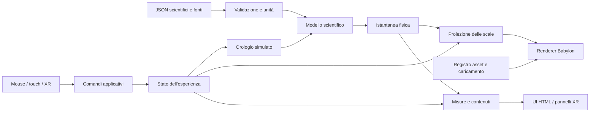

# Planetario — Architettura generale

> **Aggiornamento Fase 5, 3 ottobre 2026:** il confronto indipendente ha respinto la conica lunare congelata per l’intero intervallo. La revisione [ADR-005](ADR-005-EPHEMERIS.md) attiva il provider Hermite previsto da DATA-MODEL §6.1. Le soglie, SI, ECLIPJ2000, J2000-TDB e ±15 giorni restano invariati. Le sezioni sulla propagazione kepleriana descrivono il modello di confronto e le guide, non il provider operativo della v0.5.0. La scheda iniziale mostra Terra preselezionata; camera in panoramica scientifica, tempo fermo.


**Fasi 1–2 · Architettura consolidata · 3 ottobre 2026**

Obiettivo: costruire un osservatorio scientifico virtuale nel quale entrare, esplorare e comprendere. La scena tridimensionale deve spiegare relazioni e fenomeni; dati, immagini e interazioni devono poter essere verificati.

Questo documento conserva le decisioni della Fase 1 e le consolida nella Fase 2. Non descrive funzionalità già implementate e non certifica prestazioni o compatibilità su dispositivi reali. Le specifiche scientifiche normative sono in [DATA-MODEL.md](DATA-MODEL.md); soglie e scenari in [ACCEPTANCE-TESTS.md](ACCEPTANCE-TESTS.md). La [roadmap](ROADMAP.md) registra il punto di arresto: nessun avvio autonomo della Fase 3.

Verifica di continuità della Fase 2: `main` è ancora `fc2fae1eeb58e9b9980d4c1f6fbd2cd4afd8396a`, ultimo commit della Fase 1. Cronologia e albero GitHub non mostrano modifiche successive; `planetario/` contiene i due documenti e `gitkeep`, con blob invariati. Audit precedente conservato nella sezione seguente come fotografia storica.

## 1. Repository e vincoli verificati

Analisi iniziale della Fase 1 tramite il collegamento GitHub su `gb69prof/UTILITY`, branch `main`, commit di partenza `bba355def087d956218ba1748a95d6cda8ce567c`. L'albero completo restituito dall'API contiene 439 voci e non risulta troncato. Le voci seguenti descrivono quello stato iniziale.

- `planetario/` contiene soltanto `gitkeep`, un file di 1 byte, blob `8b137891791fe96927ad78e64b0aad7bded08bdc`. Va conservato.
- Non esistono codice, dipendenze, build o asset del Planetario da riutilizzare. Nell'albero non risultano file `AGENTS.md` del repository; restano applicabili le istruzioni dell'ambiente di lavoro.
- La radice ospita altri progetti, fra cui `Desk`, `Lezioni`, `PWA-lezioni`, `Taccuino`, `Testo-focus`, `presentazioni`, `pwa-common` e `thinkgbLink`. Sono fuori dall'ambito di modifica.
- Esistono build e service worker in singoli progetti. L'audit strutturale non ne ha esaminato tutto il codice: non si assume alcuna dipendenza condivisa.
- `.github/workflows/deploy.yml` viene attivato dai push su `main` e aggiorna via SSH `/opt/gbprof/projects/UTILITY` al contenuto di `origin/main`. Non contiene installazione di dipendenze o compilazione del frontend.
- Il workflow è stato letto, non modificato. La sua configurazione non dimostra lo stato del server né l'avvenuta pubblicazione HTTP.

Riferimenti dell'audit: [albero iniziale](https://github.com/gb69prof/UTILITY/tree/bba355def087d956218ba1748a95d6cda8ce567c), [cartella iniziale](https://github.com/gb69prof/UTILITY/tree/bba355def087d956218ba1748a95d6cda8ce567c/planetario), [workflow iniziale](https://github.com/gb69prof/UTILITY/blob/bba355def087d956218ba1748a95d6cda8ce567c/.github/workflows/deploy.yml).

Tutte le future sorgenti, configurazioni, dipendenze dichiarate e risorse generate del progetto devono stare in `planetario/`. Non modificare indice generale, workflow, altre PWA, cache o configurazioni del server senza una nuova autorizzazione esplicita. I materiali sincronizzati in `sources/` dell'ambiente ChatGPT rimangono riferimenti in sola lettura.

## 2. Decisione tecnologica

**Motore consigliato: Babylon.js, moduli ES con TypeScript. Backend iniziale: WebGL 2. VR: WebXR con rilevamento delle capacità a runtime. Build prevista: Vite.**

La scelta privilegia l'integrazione fra scena, input XR e interfacce spaziali. Non significa che Babylon.js sia intrinsecamente più veloce o più realistico di Three.js: questi aspetti dipendono da materiali, asset, passaggi di rendering e misure sui dispositivi.

### 2.1 Confronto Three.js e Babylon.js

| Criterio | Three.js | Babylon.js | Conseguenza per il Planetario |
| --- | --- | --- | --- |
| Impostazione | Libreria di rendering flessibile; composizione libera dei sottosistemi | Motore con servizi integrati per scena e interazione | Babylon riduce il codice di integrazione dell'osservatorio |
| WebXR | WebXRManager per sessioni, controller, mani e rendering stereo [T1] | Gestione sessioni, input e feature; helper per puntamento e teletrasporto [T3–T5] | Vantaggio Babylon per un primo ciclo completo osserva–seleziona–consulta |
| Pannelli VR | Realizzabili con mesh e librerie aggiuntive | GUI su mesh documentata [T6] | Presenter XR dedicato usando lo stesso modello informativo della UI HTML |
| Desktop e touch | Controlli componibili; UX applicativa da costruire | Camere e input disponibili; UX applicativa comunque da costruire | Nessun automatismo sostituisce la progettazione per iPad |
| Qualità grafica | Materiali fisici, shader personalizzati, postproduzione | Materiali fisici, shader personalizzati, postproduzione | Entrambi adeguati; nessuna superiorità visiva assunta |
| Prestazioni | Import mirati e controllo della pipeline | Import mirati e servizi già integrati, da tenere sotto controllo | Dimensioni dei pacchetti e tempi GPU vanno misurati sulla scena effettiva |
| WebGPU | Renderer dedicato; migrazione di shader e postproduzione non automatica [T2] | Backend WebGPU; integrazione XR con requisiti aggiuntivi [T3] | WebGPU non è requisito della prima milestone |
| Asset | glTF, KTX2, Draco e Meshopt tramite loader [T7] | Pipeline di asset e loader modulari, con verifica dei formati sulla versione scelta | Formati aperti; evitare asset vincolati al motore |
| Manutenzione | Pochi vincoli architetturali, più responsabilità d'integrazione | Sottosistemi coordinati, maggiore dipendenza dalle API del motore | Isolare Babylon dai dati e dai modelli fisici |
| Strumenti scientifici | Nessuna garanzia di accuratezza astronomica incorporata | Nessuna garanzia di accuratezza astronomica incorporata | Effemeridi, unità e modelli sono un livello indipendente |
| Espansione | Adatto ai futuri laboratori con infrastruttura propria | Adatto ai laboratori riusando input, GUI e ciclo delle scene | Preferenza Babylon per la continuità dell'esperienza |

Three.js resta un'alternativa valida. Va considerato anche **Meta Immersive Web SDK**, oggi basato su Three.js e su un'architettura ECS, con input, ciclo applicativo ed emulazione già integrati [T8]. Sarebbe scorretto confrontare Babylon solo con una scena Three.js elementare. Non lo si sceglie come base iniziale perché questa architettura richiede un nucleo scientifico autonomo e una UI HTML/touch curata quanto la VR; introdurre un ulteriore framework richiede una prova comparativa specifica. È una decisione progettuale, non un'affermazione di incompatibilità con iPad.

La Fase 3 bloccherà le prime versioni per una build riproducibile; la prova limitata della Fase 4 le qualificherà con un oggetto texturizzato, pannello, selezione e sessione XR reale. Successo, fallimento e condizioni per riesaminare Three.js/IWSDK sono definiti in ACCEPTANCE-TESTS, sezione 5. Nessuna riapertura del confronto in assenza di un difetto tecnico riproducibile. Non sviluppare due motori in parallelo né un'astratta compatibilità universale.

### 2.2 WebGL, WebGPU e WebXR hanno ruoli diversi

- **WebGL 2**: base del rendering iniziale per desktop, tablet e VR. Verificare la creazione del contesto; senza supporto, offrire contenuti accessibili e una spiegazione chiara. Non introdurre una seconda pipeline WebGL 1.
- **WebGPU**: possibile evoluzione per rendering e calcolo. Safari 26 lo ha introdotto anche su iPadOS [T9]; non si assume che tutti gli iPad usati a scuola abbiano sistema, hardware e capacità adeguati.
- **WebXR**: accesso a sessioni immersive, pose e dispositivi di input; non sostituisce il renderer. Richiede un contesto sicuro e le capacità del browser [T10].
- Disponibilità di WebGPU e disponibilità di `immersive-vr` non dimostrano che funzioni la combinazione WebGPU–WebXR. Babylon documenta un percorso sperimentale con `XRGPUBinding`, configurazione dell'engine e Layers [T3]. Il percorso di produzione iniziale resta WebGL 2 anche in VR.
- Un eventuale cambio backend futuro ricrea engine, scena e risorse, ripristinando lo stato applicativo. Non promettere un passaggio trasparente fra contesti GPU esistenti.

Versioni esatte di motore, Vite e strumenti saranno selezionate e bloccate nella Fase 3 con lockfile. Nessun CDN `latest` a runtime; nessuna versione sperimentale resa obbligatoria per gli studenti.

## 3. Componenti e flusso dei dati

Il dominio scientifico non importa Babylon. Il renderer legge istantanee del dominio e applica trasformazioni visive; non diventa la fonte dei dati. Lo stato contiene ambiente attivo, corpo selezionato, tempo, modalità di scala, camera, profilo grafico e livello informativo.



Struttura prevista, **non creata nelle Fasi 1–2** salvo la documentazione richiesta:

```text
planetario/
  gitkeep
  app/index.html             # ingresso sorgente per Vite
  src/
    core/                    # bootstrap, stato, clock, capacità, lifecycle
    scenes/                  # SolarSystem; in futuro i laboratori
    objects/                 # rappresentazioni di corpi, atmosfera, orbite
    rendering/               # engine Babylon, camere, materiali, scale, LOD
    data/                    # JSON scientifici, schemi, fonti, effemeridi
    physics/                 # unità, Keplero, orientamenti, misure, integratori
    assets/                  # manifest, coda, cache in memoria, budget
    input/                   # azioni, mouse/tastiera, touch
    xr/                      # sessione, controller, presenter, comfort
    ui/                      # HTML/CSS accessibile e presenter condivisi
    content/                 # Osserva / Comprendi / Approfondisci
    utils/                   # funzioni piccole prive di stato scientifico
  public/assets/             # derivati ottimizzati, texture, modelli, audio
  tools/                     # acquisizione, conversione, controlli e rilascio
  tests/                     # fisica, dati, input, browser
  docs/
  package.json
  package-lock.json
  vite.config.ts
  tsconfig.json
  index.html                 # ingresso statico di rilascio, generato in seguito
  build/                     # bundle e asset del rilascio, generati in seguito
```

Ogni ambiente implementa un contratto minimo: `load`, `activate`, `update`, `deactivate`, `dispose`. Una sola scena principale attiva, caricamento differito delle altre. Audio, ambiente e asset devono liberare le risorse quando si esce.

Le azioni condivise comprendono `selectBody`, `focusBody`, `overview`, `setTimeRate`, `setScaleMode`, `openInfo`, e in seguito `measure`, `compare`, `openLab`. I dispositivi producono azioni, non modificano direttamente dati fisici o mesh. Usare componenti e servizi espliciti; un ECS completo non è necessario per quattro corpi.

### 3.1 Build compatibile con il repository attuale

Vite compila inizialmente in una cartella di staging ignorata **dentro `planetario/`**, mai con pulizia della radice del progetto. Uno script di rilascio con elenco dei file ammessi trasferisce solo l'ingresso generato e gli asset in `planetario/index.html` e `planetario/build/`. Sorgenti e documenti non devono essere sovrascritti.

Poiché il workflow attuale copia il repository senza build, per il primo rilascio si prevede di versionare anche questi file statici verificati. Il relativo manifesto registrerà versione, hash e revisione sorgente. In seguito si potrà adottare una build CI soltanto con autorizzazione a modificare i workflow. L'URL previsto è `/UTILITY/planetario/`, da verificare sul server prima del rilascio; base path e risorse devono funzionare in sottocartella. Per il primo prototipo evitare routing che richieda riscritture lato server.

Nessun service worker nella prima milestone. Se aggiunto successivamente, scope e cache limitati al Planetario, senza cancellare cache altrui. Il funzionamento WebXR non richiede l'installazione come PWA.

### 3.2 Input Action Model — contratto consolidato

Flusso unico: **INPUT → ACTION → validazione/reducer → STATE → RENDERING/UI**. Gli adattatori leggono eventi e risultati del picking, traducono ID e intenti, quindi inviano azioni. Non ricevono il diritto di cambiare una mesh o un dato astronomico. Camera e puntamento hanno un controller applicativo, separato dagli adattatori.

```ts
type BodyId = 'sun' | 'earth' | 'moon' | 'mars';
type TimeRate = 1 | 10 | 100 | 1000 | 10000 | 100000;
type ScaleMode = 'scientific' | 'didactic' | 'exploratory';
type InfoLevel = 'observe' | 'understand' | 'deepen';
type Action =
  | { type: 'selectBody'; bodyId: BodyId }
  | { type: 'focusBody'; bodyId: BodyId }
  | { type: 'overview' }
  | { type: 'setTimeRate'; rate: TimeRate }
  | { type: 'pauseTime' }
  | { type: 'resumeTime' }
  | { type: 'resetTime' }
  | { type: 'setScaleMode'; mode: ScaleMode }
  | { type: 'setViewContext'; context: 'near-body' | 'local' }
  | { type: 'openInfo'; bodyId: BodyId; level: InfoLevel }
  | { type: 'closeInfo' }
  | { type: 'orbitView'; deltaYawRad: number; deltaPitchRad: number }
  | { type: 'zoomView'; logDistanceDelta: number }
  | { type: 'panView'; right: number; up: number }
  | { type: 'moveView'; right: number; forward: number; up: number };
type ActionEnvelope = Readonly<{
  actionId: string; source: 'mouse' | 'keyboard' | 'touch' | 'xr' | 'ui';
  inputSessionId: string; sequence: number; realNowMs: number;
  action: Action;
}>;
```

L'envelope aggiunge diagnostica e deduplicazione, non una seconda logica per dispositivo. `actionId=inputSessionId+sequence` univoco, sequence crescente; duplicati ignorati nella sessione. Valori non finiti, ID non presenti o comandi non ammessi nello stato corrente sono respinti con motivo; non corrette azioni per tentativi. La validazione non usa timestamp remoti o civil time.

| Azione | Transizione obbligatoria |
| --- | --- |
| selectBody | Imposta selectedBody, apre livello Osserva; non avvicina né cambia tempo |
| focusBody | Seleziona il corpo, apre Osserva coerente con la selezione, imposta focusedBody e contesto locale; camera orbit su schermo, xr-observatory in XR; pausa durante la transizione e ripresa esplicita |
| overview | Azzera focusedBody e imposta contesto sistema; camera overview su schermo, xr-observatory in XR; conserva selectedBody e pannello; pausa durante il cambio contesto |
| setTimeRate/pauseTime/resumeTime/resetTime | Comando al solo SimulationClock, secondo DATA-MODEL; nessun aggiornamento diretto delle posizioni |
| setScaleMode | Aggiorna proiezione e dichiarazioni, conserva dati, selezione e contesto; tempo fermo durante il cambio |
| setViewContext | Richiede focusedBody; passa fra vicino e locale con pausa e cambio scala, senza alterare pose XR |
| openInfo | Seleziona bodyId e livello richiesto; non cambia camera |
| closeInfo | Chiude pannello, conserva selezione; focus HTML al controllo che lo ha aperto |
| orbitView/zoomView/panView/moveView | Controller della camera modifica il proprio stato numerico e poi il renderer applica il risultato; nessun movimento della camera XR imposto da queste azioni |

`panView` usa frazioni della larghezza/altezza del viewport; `moveView` usa componenti d'intento in [−1,1], convertite dal controller in velocità contestuale e integrate sul tempo reale. `zoomView` usa variazione logaritmica della distanza, per consistenza fra scale. Orbitazione limita il pitch prima del polo, senza rollio; i limiti iniziali sono ±89°. Il renderer riceve una camera già decisa, non reinterpreta gli eventi.

Click/tap vengono emessi al rilascio solo se un singolo puntatore non si è mosso oltre 8 CSS px; secondo dito, pointercancel o perdita della cattura annullano la selezione. Wheel/pinch producono zoom, drag orbitazione, pan a due dita spostamento. Pointer capture solo sul canvas, scorrimento dei pannelli preservato. Tastiera: Tab sui controlli, Enter attiva, Escape chiude il pannello o annulla la transizione; WASD solo nella modalità esplora e senza campo testo attivo.

XR: usare l'evento semantico `select` per confermare, `selectstart/selectend` solo per feedback; non generare una seconda azione leggendo lo stesso trigger tramite Gamepad. Target UI spaziale ha priorità sugli oggetti dietro di esso. Picking produce BodyId senza cambiare la selezione prima del reducer. Tracking a 6DoF appartiene al runtime XR, non viene convertito in `moveView`.

`measure`, `compare` e `openLab` sono riservate alle fasi future e non fanno parte dell'unione accettata v1. Comandi di qualità e ciclo XR sono eventi di servizio distinti, sottoposti alle stesse regole di stato. Nessun pulsante attivo deve inviare un comando non implementato.

### 3.3 Interaction State — contratto consolidato

Un piccolo store con reducer puro, servizi espliciti e sottoscrizioni selettive è sufficiente; nessuna dipendenza da uno state manager complesso. Stato del dominio e del rendering non vengono duplicati nel reducer.

```ts
type EnvironmentId = 'SolarSystem' | 'GravityLab' | 'LightLab'
  | 'EnergyLab' | 'EarthLab' | 'LifeLab';
type XrState = 'unsupported' | 'idle' | 'entering' | 'active' | 'exiting' | 'error';
type InteractionState = Readonly<{
  environment: EnvironmentId; // solo SolarSystem registrato nella v1
  selectedBody: BodyId | null;
  focusedBody: BodyId | null;
  scaleMode: ScaleMode;
  viewContext: 'system' | 'near-body' | 'local';
  cameraMode: 'overview' | 'orbit' | 'explore' | 'xr-observatory';
  qualityProfile: 'auto' | 'quality' | 'performance';
  info: Readonly<{ bodyId: BodyId; level: InfoLevel }> | null;
  xrSessionState: XrState;
  transition: 'none' | 'focus' | 'scale' | 'environment';
  error: Readonly<{ code: string; message: string }> | null;
}>;
```

Iniziale: SolarSystem, selected/focused null, scala scientifica, contesto system, overview, Auto, info null, transition none; XR unsupported o idle dopo capability check. focusBody entra in near-body; sullo schermo il CameraController richiede local quando la distanza dal fuoco scende sotto 6 raggi fisici, e near-body sopra 8 raggi (isteresi). Il cambio aggiorna lo stato e avviene con transizione di scala e pausa. In XR i pulsanti di osservazione emettono setViewContext, senza zoom delle pose. Tempo e rate sono esposti in una vista composta `{interaction, clockSnapshot}`, dove il clock è l'unica fonte. Posizioni, velocità e orientamenti provengono dal provider; i dettagli numerici della camera vivono nel CameraController e sono serializzabili, senza oggetti Babylon.

Invariant: se info è aperto, info.bodyId=selectedBody; focusedBody può differire, per leggere un altro corpo senza muovere la camera. `xrSessionState=active` implica cameraMode=xr-observatory; il controller conserva la camera schermo per il ritorno. Un ambiente non registrato restituisce errore leggibile, non un canvas vuoto. Durante una transizione, ignorare picking/gesti di camera; restano disponibili chiusura/cancel, pausa e uscita XR. Un nuovo focus sostituisce la transizione precedente con cancellazione controllata.

### 3.4 Contratto degli ambienti — lifecycle consolidato

```ts
type EnvironmentFrame = Readonly<{
  realNowMs: number; uiDeltaSeconds: number;
  tTdbSeconds: number;
}>;
interface Environment {
  readonly id: EnvironmentId;
  load(context: EnvironmentContext, signal: AbortSignal): Promise<void>;
  activate(): void;
  update(frame: EnvironmentFrame): void;
  deactivate(): void;
  dispose(): Promise<void>;
}
```

`EnvironmentContext` è un insieme di porte: lettura dello stato/clock; accesso al registro di provider; AssetService con handle a proprietà esplicita; SceneHost per registrare/rimuovere rappresentazioni; dispatcher delle azioni; logging. Non è uno store globale mutabile. SceneHost è il punto d'integrazione grafica: i dati e i laboratori fisici non importano Babylon. Ogni laboratorio futuro sceglie il proprio modello del dominio usando le stesse porte, senza essere obbligato a simulare corpi celesti.

Stati ammessi: `new → loading → ready → active → ready → disposed`; `loading → failed`, `loading → disposed` tramite abort. load chiamato una volta per istanza; activate soltanto da ready; update soltanto da active. deactivate da active stacca input, audio e sottoscrizioni e torna ready; ripetuto su ready è innocuo. dispose è idempotente, abortisce carichi pendenti, deattiva se necessario e rilascia tutte le risorse possedute; da disposed nessuna riattivazione.

Un solo ambiente attivo. Per cambiarlo: mettere in pausa il tempo, caricare il candidato senza attivarlo, disattivare il precedente, attivare il nuovo e infine disporre il precedente. Se load fallisce, liberare il candidato e lasciare il precedente disponibile; se activate fallisce, riattivare il precedente prima di rilasciare il candidato. La breve sovrapposizione delle risorse deve rientrare nel budget; in caso contrario usare una schermata di caricamento e ricostruire il precedente su rollback. Contatori degli handle/listener verificano l'assenza di perdite.

Il scheduler invoca il clock una volta e passa l'istante alla scena attiva. SolarSystem richiede un solo snapshot atomico, applica ScaleProjection e aggiorna le rappresentazioni. `uiDeltaSeconds` è tempo reale limitato a 0,1 s per i soli effetti UI; non limita o integra il tempo astronomico. Nessuna istanza futura GravityLab/LightLab/EnergyLab/EarthLab/LifeLab è implementata in questa fase.

## 4. Dati e accuratezza scientifica

I dati vengono acquisiti e revisionati in preparazione della build. L'esperienza iniziale non dipende da chiamate a NASA/JPL durante la navigazione: deve usare snapshot versionati e riproducibili. La specifica normativa è DATA-MODEL, sezioni 1–6 e 10: schema JSON con validazione strutturale e semantica, elementi osculatori congelati a JD 2451545.0 TDB, dominio ±15 giorni, output geometrico eliocentrico ECLIPJ2000. Le soglie di accettazione sono fissate, ma la conformità del futuro dataset non è ancora misurata.

Ogni grandezza deve contenere almeno `value`, `unit`, `sourceId`, definizione e, quando disponibili, incertezza e data di riferimento. Valori assenti sono `null`, mai zero inventato. Per intervalli o composizioni usare strutture esplicite, non stringhe da interpretare.

| Gruppo | Campi previsti e distinzioni necessarie |
| --- | --- |
| Identità | ID stabile, nome italiano, tipo, identificatore JPL/NAIF se pertinente, corpo centrale |
| Geometria e massa | Massa, parametro gravitazionale GM, raggio medio/equatoriale/polare; diametro derivato dal raggio dichiarato |
| Orbita | Semiasse maggiore, eccentricità, inclinazione, nodo ascendente, argomento del pericentro, anomalia all'epoca, epoca, sistema di riferimento, validità |
| Rotazione | Periodo siderale, verso, orientamento del polo, meridiano iniziale, modello e riferimento dell'inclinazione assiale |
| Proprietà | Gravità con definizione, temperature con quota/pressione o tipo di superficie, composizione con frazioni e unità |
| Quantità variabili | Posizione, distanza fra centri o superfici, velocità istantanea e tempo della luce, derivati dal modello all'istante corrente |
| Provenienza | Fonte, URL, versione, acquisizione, trasformazioni, qualità e limiti |

Il semiasse maggiore non va etichettato come distanza istantanea. Temperatura superficiale, temperatura efficace e temperatura della fotosfera non sono intercambiabili. Il giorno solare non coincide con il periodo di rotazione siderale.

Unità canoniche del dominio: metri, secondi, chilogrammi e radianti, con numeri JavaScript a doppia precisione o `Float64Array`. Unità astronomiche, chilometri, giorni e gradi entrano/escono attraverso conversioni esplicite. Per la dinamica preferire GM quando disponibile; non ricavare una massa apparentemente più precisa dividendo GM per una costante G poco precisa. Costanti con provenienza [S3].

`BodyStateProvider` espone posizione, velocità, orientamento e metadati di accuratezza per corpo e tempo. Il contratto deve consentire due implementazioni senza cambiare il renderer:

1. **KeplerianProvider**, prima milestone: modello educativo a due corpi, con parametri riferiti a un'epoca e intervallo dichiarato. Le ellissi devono rispettare la variazione della velocità orbitale, non essere percorse ad angolo uniforme. Marte e sistema Terra–Luna si riferiscono al Sole; la Luna ha un modello relativo dedicato.
2. **EphemerisProvider**, successivo: campioni di vettori JPL Horizons preparati offline, intervallo limitato e interpolazione con errore verificato. Nessuna estrapolazione silenziosa.

Le formule approssimate JPL distinguono il baricentro Terra–Luna dal centro della Terra [S1]. La v1 consolidata sceglie elementi osculatori Horizons congelati, non i coefficienti secolari di quella tabella: propaga EMB/Sole, Marte/Sole e Luna/Terra, poi ricostruisce Terra e Luna dal baricentro con rapporti dei GM. Ricetta d'importazione e formule sono in DATA-MODEL. Non mescolare elementi riferiti a piani, centri o versioni differenti.

Il modello iniziale non predice eclissi, occultazioni o puntamenti osservativi con accuratezza certificata. La sincronia lunare è una prima approssimazione; librazioni, precessione e perturbazioni saranno introdotte solo con modelli e verifiche dedicati. Gravity Lab avrà un integratore numerico separato e scenari modificabili, senza alterare il dataset canonico del Sistema solare.

## 5. Tempo e coordinate

Un unico `SimulationClock` distingue il tempo monotono usato per animare l'interfaccia dal tempo della simulazione. Controlli previsti: pausa, play, ×1, ×10, ×100, ×1000, ×10000, ×100000 e ripristino dell'epoca iniziale del dataset. Il moltiplicatore e la data/modello sono sempre visibili.

Il tempo simulato usa la formula ancorata definita in DATA-MODEL, sezione 7; posizione e rotazione si ricalcolano dal tempo assoluto, senza accumulare piccoli incrementi a ogni frame. Ridurre gli angoli modulo un giro per stabilità numerica. Stato iniziale e reset: t=0, ×1, pausa. Scheda nascosta, gap >1000 ms, transizioni XR o perdita tracking sospendono il tempo; la ripresa è esplicita. Le transizioni della camera usano secondi reali, non l'accelerazione astronomica.

L'epoca interna è fissata a JD 2451545.0 TDB, secondi relativi in doppia precisione; intervallo inclusivo [−1296000,+1296000] s. La UI v1 mostra il tempo trascorso dall'epoca, non una data civile UTC non convertita. La conversione futura UTC–TAI–TT–TDB e i limiti sono definiti in DATA-MODEL. `Date` non è un convertitore astronomico. Horizons richiede attenzione a scala temporale, centro, frame e correzioni osservative [S2].

Convenzione consolidata: frame eclittico J2000 destrorso, output con centro Sole, suborbite con centri espliciti. L'adattatore usa esattamente `(x, y, z) → (x, z, -y)` e Babylon destrorso. Testare verso delle orbite, polo nord e orientamento delle texture con punti noti. Orientamento corpo→frame e trasformazione mesh/UV restano distinti.

Rotazione propria, orientamento dell'asse e posizione orbitale sono trasformazioni distinte. Non ruotare il piano orbitale quando ruota il pianeta. A velocità elevate segnalare il possibile aliasing temporale: una rotazione apparentemente ferma o inversa non è un fenomeno fisico.

## 6. Tre modalità di scala

Lo stato fisico è unico. `ScaleProjection` produce posizioni e raggi per il rendering, più le informazioni da mostrare sulla scala. Cambiare modalità non cambia massa, orbita o tempo.

| Modalità | Regola | Avvertenza visibile |
| --- | --- | --- |
| Scientifica | Un solo fattore lineare per distanze e raggi nel dominio mostrato: `p = (r − origine) / L`, `raggio = R / L` | «Dimensioni e distanze nella stessa scala». Corpi piccoli possono diventare subpixel |
| Didattica | Distanze inizialmente lineari; raggi moltiplicati per fattori dichiarati. Sistema Terra–Luna eventualmente in una vista separata | «Dimensioni ingrandite» con fattori per corpo; indicare anche eventuale adattamento delle distanze |
| Esplorativa | Passaggio fra vista del sistema, vicinanze di un corpo e osservatorio locale; scala adattata al contesto | «Scala esplorativa» e rapporto corrente; la transizione non simula un volo fisico |

Preset v1 fissati in DATA-MODEL, sezione 8: panoramica `L = 1 au` per unità; viste del corpo `L = 10 Rfocus` e `2 Rfocus`. Scientifica: fattori dei raggi tutti 1; didattica panoramica: Sole 5, Terra/Luna/Marte 1000, distanze invariate. La sovrapposizione Terra–Luna si risolve con selezione di gruppo e vista locale, senza separazione spaziale nascosta. Sono parametri di presentazione da collaudare. Per il confronto dimensionale futuro usare un fattore comune ai raggi, con corpi affiancati e distanze di disposizione esplicitamente convenzionali.

In modalità scientifica i marcatori possono restare leggibili ma devono essere separati dalle superfici: «indicatore, non dimensione del corpo». Nessun raggio minimo invisibilmente imposto alla mesh scientifica. La selezione può usare un'area di tolleranza maggiore della sagoma, senza falsificare la visualizzazione.

La prima modalità didattica non necessita di distanze logaritmiche. Una futura compressione, per esempio `d' = A log(1 + d / d0)`, deve avere parametri registrati e non essere presentata come scala proporzionale. Orbite e corpi devono attraversare la stessa proiezione: con una trasformazione non lineare non si disegna una semplice ellisse indipendente dalla posizione trasformata.

### Precisione numerica e profondità

- Conservare le coordinate astronomiche in doppia precisione sulla CPU; inviare alla GPU posizioni relative all'osservatore o al centro locale, dopo sottrazione e riduzione di scala.
- Separare la panoramica e la scena di dettaglio. Una camera con `near` microscopico e `far` astronomico non è una soluzione alla profondità né alla precisione dei vertici.
- Effettuare il cambio dell'origine prima del rendering per evitare tremolii. In XR il riferimento metrico della testa resta stabile: trasformare il mondo astronomico sotto un nodo dedicato, senza riscalare pose o distanza interpupillare.
- Il depth buffer logaritmico o altre tecniche di profondità sono eventuali ottimizzazioni da verificare su shader, WebGL e stereo; non sostituiscono la gestione dell'origine.
- Il cielo stellato è uno sfondo direzionale a distanza apparente infinita; non riceve parallasse da spostamenti nel Sistema solare.

**Misure e luce**: distanze e `d/c` usano coordinate fisiche. La direzione della luce si ricava dal vettore fisico corpo–Sole; non da posizioni didattiche alterate. Eclissi future richiedono geometria fisica e provider validato. In una vista con raggi ingranditi non vanno generate false eclissi mediante le sole mesh visibili.

## 7. Asset e resa visiva

Nelle Fasi 1–2 non si scaricano né si incorporano texture. Le risorse qui elencate sono **candidate**, non asset già acquisiti o autorizzati all'uso.

| Oggetto | Prima risorsa candidata | Trattamento previsto |
| --- | --- | --- |
| Terra | NASA Blue Marble Next Generation [A1] | Superficie composita con data e stagionalità dichiarate; scegliere variante senza ombre/nuvole già incorporate per gli strati separati |
| Luna | NASA SVS CGI Moon Kit, colore LROC e quota LOLA [A2] | Colore e rilievo documentati; normal map derivata con intensità e conversione registrate |
| Marte | USGS Mars Viking Global Color Mosaic 925 m [A3] | Mosaico calibrato; verificare proiezione, meridiano, orientamento e trattamento del colore |
| Stelle | NASA SVS Deep Star Maps 2020 [A4] | Sfondo orientato al frame celeste; dichiarare la resa fotografica e l'esposizione adattata |
| Sole | Dati SDO/HMI e documentazione degli strumenti [A5] | Riferimento osservativo per fotosfera e attività; un'immagine del disco non è una mappa globale |

Per ogni asset, `asset-manifest.json` dovrà contenere ID, nome, autore/ente, pagina originale, URL esatto del file, versione, data dell'osservazione, data di acquisizione, termini d'uso e loro URL, attribuzione, hash SHA-256, proiezione, spazio colore, risoluzione, trasformazioni e derivati. Se la licenza non è chiara, lo stato resta `candidate`: l'asset non entra nella build. Nessuna licenza universale dedotta dal solo logo NASA, ESA o USGS.

`SCIENTIFIC-SOURCES.md` e `ASSET-SOURCES.md`, previsti nelle fasi successive, saranno registri leggibili collegati ai manifest. Distinguere sempre osservazione, mosaico, derivato topografico, ricostruzione procedurale e illustrazione. Non generare con IA mappe presentate come dati osservativi.

Pipeline prevista: acquisizione originale → controllo provenienza → correzione della proiezione → derivati a più risoluzioni → compressione → controllo visivo → registrazione hash. Gli originali molto grandi non vanno caricati nel browser né aggiunti automaticamente a Git; conservarne identificazione e provenienza, decidendo un archivio appropriato quando necessario.

Texture iniziali 1K/2K, 4K solo sul corpo osservato e se il budget lo consente. KTX2/Basis per ridurre trasporto e memoria dove la transcodifica è supportata, con mipmap; ETC1S candidato per colore e UASTC per mappe sensibili agli artefatti, da verificare [A6]. Fallback JPEG/PNG/WebP a risoluzione ridotta se necessario. Il formato compresso del download non prova il consumo GPU finale.

Modelli futuri in glTF/GLB; Meshopt o Draco solo quando il risparmio supera il costo dei decoder. Non servono modelli pesanti per semplici sfere. Decoder, worker e modelli dei controller devono essere versionati e, ove consentito dai termini, serviti localmente.

### Terra, Sole, illuminazione

Terra: materiale di superficie con oceani distinti nella risposta speculare, terminatore giorno/notte e asse corretto. Nuvole, atmosfera, luci urbane e rilievi entrano per passi verificabili; le luci notturne si mascherano sul lato non illuminato. Un mosaico storico non rappresenta il meteo della data simulata. L'esagerazione verticale di un rilievo va dichiarata.

Sole: fotosfera emissiva con attenuazione verso il bordo e struttura di granulazione studiata da riferimenti fisici. Eventuali dettagli procedurali sono etichettati come ricostruzione; non sono dati solari in diretta. Emissione e bloom sono distinti: il materiale emissivo non illumina automaticamente i pianeti. Una corona visibile con esposizione aumentata non deve sembrare una nube arancione permanente. Immagini EUV a falsi colori non diventano «colore reale» del Sole. Protuberanze e attività animata vengono dopo il nucleo iniziale.

Un'unica sorgente solare concettuale; per ciascuna vista locale illuminazione direzionale derivata dalla geometria fisica. Intensità e tone mapping devono distinguere irradiamento fisico da compensazione dell'esposizione per rendere leggibile la scena. Ombre locali selettive, senza enormi shadow map sull'intero sistema. Il futuro calcolo energetico usa la distanza fisica e la legge dell'inverso del quadrato.

Le stelle visibili insieme al disco solare brillante implicano un'esposizione didattica/composita: dichiararlo. Evitare nebulose decorative, scintillio atmosferico nello spazio e particelle prive di significato scientifico.

## 8. Interazione desktop, touch e VR

| Azione | Desktop | Tablet/iPad | VR |
| --- | --- | --- | --- |
| Osservare | Drag per orbitare; wheel per avvicinare/allontanare | Drag a un dito; pinch per zoom | Movimento naturale della testa; oggetto collocato nello spazio |
| Spostarsi | Pan; modalità esplora con WASD e velocità controllata | Pan a due dita; navigazione tramite destinazioni | Posizioni di osservazione e cambio destinazione con dissolvenza |
| Selezionare | Click; elenco raggiungibile da tastiera | Tap distinto dal drag | Raggio del controller e evento di selezione |
| Avvicinarsi | Comando esplicito dopo la selezione | Pulsante «Avvicinati» | Pulsante spaziale; cambio del mondo, non animazione forzata della testa |
| Tornare | «Vista generale» e scorciatoia documentata | Pulsante sempre raggiungibile | «Torna all'osservatorio» nel pannello |
| Informazioni | Pannello HTML con focus gestito | Pannello laterale in landscape; scheda inferiore in portrait | Pannello nel mondo, con distanze e leggibilità verificate |

Pointer Events come base comune per schermo. Soglia di movimento, annullamento dei gesti e cattura del puntatore impediscono selezioni accidentali dopo un drag. Un pizzicamento non cambia silenziosamente da zoom a pan. Gesto di rotazione a due dita solo se utile e con legenda; nessun rollio libero iniziale. Le gesture riguardano il canvas: nei pannelli deve funzionare lo scorrimento del testo e non si disabilita lo zoom dell'intera pagina.

Un tocco seleziona; un secondo comando decide il viaggio. Nessuna partenza automatica sul semplice tap. I comandi di confronto e misura saranno introdotti quando funzionanti, senza pulsanti vuoti nella prima milestone.

UI touch: bersagli almeno 44 × 44 CSS px, safe area, pannelli richiudibili, gestione del ridimensionamento del viewport e rotazione del dispositivo. Landscape è un layout di prima classe, non una versione allargata del telefono.

### WebXR e comfort

Ingresso disponibile dopo `navigator.xr.isSessionSupported('immersive-vr')`, con gestione degli errori e avvio da gesto esplicito. HTTPS anche sul test via rete locale; `localhost` sul computer non rende automaticamente sicuro un indirizzo LAN aperto nel Quest.

`local-floor` preferito se disponibile; fallback `local` con posizione di osservazione e ricentratura controllate. Controller con `targetRaySpace`, profili di input e ciclo di connessione/disconnessione [T5]. Trigger o `select` producono una singola azione; evitare doppia attivazione tra eventi del motore e Gamepad. Hand tracking e pinch sono estensioni successive, mai prerequisiti.

La prima esperienza VR è un osservatorio a postazione stabile con un sistema rappresentato davanti all'utente e viste ravvicinate. Testa e controller rimangono in metri reali; gli oggetti astronomici appartengono a un mondo scalato. Non si pretende di percorrere fisicamente unità astronomiche.

Viaggi iniziali: dissolvenza breve, cambio della posizione del mondo o del punto di osservazione, riapparizione e mantenimento dell'orientamento della testa. Niente volo continuo obbligatorio, rollio, camera cinematografica o rotazione automatica del campo visivo. Snap turn opzionale nelle fasi successive. Teletrasporto su superfici soltanto quando esiste un ambiente con appoggi sensati: non inventare un pavimento cosmico per usare una funzione del motore.

I pannelli HTML non diventano automaticamente visibili in VR: serve un presenter spaziale dedicato, con gli stessi contenuti e comandi. Per testi lunghi privilegiare approfondimento su schermo. Gestire uscita XR, rifiuto dei permessi, perdita del tracking e sessione interrotta senza perdere selezione o tempo.

## 9. Prestazioni: obiettivi da misurare

I seguenti numeri sono **budget iniziali di progetto**, non limiti hardware garantiti né risultati di benchmark. Indicare sempre modello, sistema operativo, browser, risoluzione e profilo nei rapporti di prova.

| Indicatore | iPad / Android iniziale | Quest VR iniziale | Desktop qualità |
| --- | --- | --- | --- |
| Frame rate | Obiettivo 60 fps; profilo ridotto 30 fps su hardware meno potente | Sostenere il refresh scelto fra quelli disponibili; 72 Hz se supportato, poi 90 Hz | Obiettivo 60 fps |
| Budget teorico frame | 16,7 ms a 60 Hz | 13,9 ms a 72 Hz; 11,1 ms a 90 Hz, con margine applicativo | 16,7 ms |
| Draw call applicative | Obiettivo ≤100 per frame | Obiettivo ≤100 complessive, conteggio stereo esplicitato | Obiettivo ≤200 |
| Triangoli visibili | Obiettivo ≤250.000 | Obiettivo ≤200.000 per vista | Obiettivo ≤750.000 |
| Memoria GPU stimata | Budget iniziale 128 MiB | Budget iniziale 128 MiB | Budget iniziale 256 MiB |
| Texture corpo in primo piano | 2K, 4K opzionale | 2K iniziale | 4K su richiesta |
| Avvio trasferito | Obiettivo ≤8 MiB, inclusi codice, decoder e asset minimi | Stesso obiettivo, pacchetto XR incluso quando richiesto | Stesso avvio progressivo |

La memoria GPU stimata comprende texture residenti, mipmap, geometrie e render target, contando le superfici stereo dove applicabile. Non esiste una lettura portabile affidabile della VRAM libera: sommare le allocazioni note e mantenere margine. Una texture 4096 × 2048 RGBA8 occupa circa 32 MiB, circa 42,7 MiB con tutti i mipmap, anche se il JPEG pesa poco.

Profili: **Auto**, **Qualità**, **Prestazioni**. Auto parte conservativo, rileva capacità e misura tempi durante l'uso; non deduce tutto dal nome del dispositivo. Riduce prima postproduzione, strati trasparenti, risoluzione e LOD, preservando leggibilità e contenuti. Cambia livello con isteresi, senza oscillazioni a ogni frame. Qualità resta entro i limiti misurati; in XR il comfort prevale sugli effetti.

Strategia:

- Caricare il minimo per la panoramica; acquisire texture dettagliate solo per il corpo osservato. Coda con concorrenza limitata, richieste annullabili, fallback e rilascio esplicito delle risorse.
- LRU con conteggio dei riferimenti; permettere per breve tempo due livelli di texture durante il cambio solo se il budget lo consente. Rilasciare buffer decodificati e bitmap non più necessari.
- LOD guidato dalla dimensione proiettata; una sola geometria/materiale condiviso dove possibile. Stelle in uno sfondo o un batch, non migliaia di oggetti indipendenti. Instancing per futuri asteroidi, senza simulare ogni frammento.
- Frustum culling standard; occlusion query solo dopo misure, perché nel vuoto pochi corpi si nascondono reciprocamente. Ridurre passaggi e aggiornamenti dei pannelli prima di aggiungere complessità.
- Atmosfera e nuvole con pochi strati; bloom ridotto o disattivato su Quest; niente SSAO, volumetrie costose o ombre globali per impostazione iniziale.
- Cap del device pixel ratio su schermo; in VR usare i controlli della superficie XR. Multiview e foveazione solo se disponibili e collaudati; non presupporre eye tracking.
- Caricamento e transcodifica asincroni, worker per operazioni pesanti quando necessario, riscaldamento degli shader durante i caricamenti. Non introdurre SharedArrayBuffer come requisito.
- Gestire perdita/ripristino del contesto WebGL, sospensione, memoria insufficiente e cambio orientamento. Un errore di texture non deve bloccare l'intera UI.

Profilare separatamente CPU e GPU, percentili e frame mancati. Il tempo del solo callback JavaScript non misura l'intera pipeline. Le linee guida Meta richiedono verifica delle ottimizzazioni sul visore: emulazione e medie FPS non bastano [P1–P2].

## 10. Contenuti, accessibilità ed estensione

Tre livelli collegati allo stesso ID del corpo: **Osserva**, dati essenziali; **Comprendi**, spiegazione breve e confronti; **Approfondisci**, fisica, chimica, storia e missioni con fonti. Separare testo editoriale, dato misurato e risultato del modello. Le grandi domande collegano ambienti e fenomeni: «Perché la Terra non cade sul Sole?» conduce al laboratorio gravitazionale, «Perché vediamo il Sole?» a quello della luce.

UI HTML semantica con elenco alternativo dei corpi, focus visibile, navigazione da tastiera, testo scalabile, contrasto e stato non affidato soltanto al colore. Verificare ingrandimento al 200%. `prefers-reduced-motion` elimina viaggi animati e decorazioni; la simulazione si può mettere in pausa e avanzare esplicitamente. Non annunciare con screen reader ogni frame del tempo.

Gli ambienti futuri riusano clock, unità, fonti, input e contenuti. Gravity Lab introduce esperimenti numerici e controlli di conservazione; Light Lab onda, spettro e tempo di propagazione; Energy Lab trasformazioni e radiazione; Earth Lab geologia, atmosfera e acqua; Life Lab processi chimici e biologici, con propri modelli e limiti. Non presentare l'origine della vita come un processo completamente risolto o una conseguenza automatica di una singola simulazione.

Audio predisposto come servizio disattivato inizialmente, avviato soltanto dopo interazione: narrazione, sottotitoli e futura sonificazione. Qualsiasi suono associato al vuoto cosmico va qualificato come narrazione o sonificazione.

## 11. Verifica e rischi aperti

Nelle Fasi 1–2 si verificano documentazione, fonti e perimetro delle modifiche. Non c'è un'applicazione da eseguire. Le verifiche di runtime e scientifiche sono definite nella [matrice di accettazione](ACCEPTANCE-TESTS.md), non già superate. Dispositivi, versioni delle dipendenze e file definitivi del dataset restano attività delle fasi successive; convenzioni, contratti e soglie sono invece chiusi.

| Rischio | Decisione e criterio di controllo |
| --- | --- |
| Differenze Safari/iPad | Percorso WebGL 2/touch completo; prova fisica di gesture, memoria, landscape e ripresa |
| WebGPU e XR in evoluzione | Nessuna dipendenza obbligatoria nella prima milestone; verificare le capacità separatamente |
| Perdita di precisione | Dominio in doppia precisione, origine locale e viste separate; test a distanze estreme |
| Scala ingannevole | Indicazioni permanenti, fattori consultabili e misure da coordinate fisiche |
| Modello orbitale approssimato | Validità dichiarata, confronto con riferimento e nessuna previsione di eclissi nella prima milestone |
| Asset inadatti o termini incerti | Provenienza per file; esclusione dalla build finché non verificata |
| Comfort e prestazioni VR | Postazione stabile; test fisico prolungato, senza equiparare emulazione e visore |
| Pubblicazione senza build | Rilascio statico preparato dentro planetario; verifica indipendente di workflow e contenuti HTTP |

## 12. Fonti consultate

Consultazione: 3 ottobre 2026. Le documentazioni online evolvono e alcune pagine conservano esempi storici: verificare API e versioni nella Fase 3. I riferimenti sostengono le capacità dichiarate; architettura, budget e criteri di rilascio sono proposte specifiche per questo progetto.

### Motori e piattaforme

- **T1** — [Three.js: WebXRManager](https://threejs.org/docs/pages/WebXRManager.html).
- **T2** — [Three.js: WebGPURenderer, migrazione e stato del renderer](https://threejs.org/manual/pages/webgpurenderer).
- **T3** — [Babylon.js: WebXR, inclusi i requisiti WebGPU–XR](https://github.com/BabylonJS/Documentation/blob/master/content/features/featuresDeepDive/webXR/introToWebXR.md).
- **T4** — [Babylon.js: WebXR Experience Helpers](https://github.com/BabylonJS/Documentation/blob/master/content/features/featuresDeepDive/webXR/webXRExperienceHelpers.md).
- **T5** — [Babylon.js: controller e input WebXR](https://github.com/BabylonJS/Documentation/blob/master/content/features/featuresDeepDive/webXR/webXRInputControllerSupport.md).
- **T6** — [Babylon.js: esempi XR e GUI su mesh](https://github.com/BabylonJS/Documentation/blob/master/content/features/featuresDeepDive/webXR/webXRDemos.md).
- **T7** — [Three.js: GLTFLoader e decoder](https://threejs.org/docs/pages/GLTFLoader.html).
- **T8** — [Meta: Immersive Web SDK](https://developers.meta.com/vr/documentation/iwsdk/guides/overview/).
- **T9** — [WebKit: funzionalità di Safari 26.0](https://webkit.org/blog/17333/webkit-features-in-safari-26-0/).
- **T10** — [W3C: WebXR Device API](https://www.w3.org/TR/webxr/).

### Modelli e dati

- **S1** — [JPL: Approximate Positions of the Planets](https://ssd.jpl.nasa.gov/planets/approx_pos.html), intervalli, errori nominali e baricentro Terra–Luna.
- **S2** — [JPL: manuale Horizons](https://ssd.jpl.nasa.gov/horizons/manual.html).
- **S3** — [JPL: costanti astrodinamiche](https://ssd.jpl.nasa.gov/astro_par.html).
- **S4** — [JPL: parametri fisici planetari](https://ssd.jpl.nasa.gov/planets/phys_par.html).

### Asset candidati e prestazioni

- **A1** — [NASA: Blue Marble Next Generation](https://science.nasa.gov/earth/earth-observatory/blue-marble-next-generation/).
- **A2** — [NASA SVS: CGI Moon Kit](https://svs.gsfc.nasa.gov/4720/).
- **A3** — [USGS: Mars Viking Global Color Mosaic 925m](https://astrogeology.usgs.gov/search/map/mars_viking_global_color_mosaic_925m).
- **A4** — [NASA SVS: Deep Star Maps 2020](https://svs.gsfc.nasa.gov/4851/).
- **A5** — [NASA SDO: dati e strumenti](https://sdo.gsfc.nasa.gov/data/).
- **A6** — [Khronos: KTX](https://www.khronos.org/ktx/).
- **P1** — [Meta: metodo di analisi delle prestazioni WebXR](https://developers.meta.com/vr/documentation/web/webxr-perf-workflow/).
- **P2** — [Meta: buone pratiche prestazionali WebXR](https://developers.meta.com/vr/documentation/web/webxr-perf-bp/).


### Addendum Fase 6 — schermo astronomico

`SolarController` applica gli envelope a selezione/scheda/camera e al solo Clock. Mouse, touch, tastiera e HTML inviano le stesse azioni; id e sequenze duplicati/obsoleti, valori non finiti, corpi sconosciuti e richieste fuori intervallo vengono rifiutati. La scena astronomica non accetta ancora input XR: il collaudo tecnico resta separato fino alla Fase 8.

Comandi aggiunti: `seekTime {tTdbSeconds}` (solo intervallo chiuso ±1296000 s, pausa, conserva rate e blocchi ambientali), `recenterView` (azzera pan conservando orbita, contesto e tempo), `setGuide {key,value}` (solo visualizzazione). `openInfo` riapre la selezione corrente. Chiudere la scheda non cambia selezione, fuoco o tempo; Esc dal pannello restituisce il focus HTML al controllo d'origine. Transizioni immediate, senza viaggio animato obbligatorio anche per chi preferisce movimento ridotto.

`panView` contiene frazioni del viewport; il controller usa distanza, FOV verticale 0,8 rad e rapporto larghezza/altezza per convertirle in unità di rendering. Il target viene proiettato sugli assi destra/alto della camera. Limiti: ±1 unità in near-body, ±5 nelle altre viste, compensazione ×5/÷5 nel cambio di scala. Camera e target rimangono entro l'inviluppo di 32 unità verificato: questa navigazione orbitale limitata non abilita il volo libero o un nuovo rebase XR.

I marcatori condividono il riconoscitore dei gesti del canvas: un drag iniziato sull'etichetta orbita/sposta, non seleziona al rilascio. Solo un tap a singolo puntatore in modalità Orbita seleziona; la modalità Sposta e Maiusc/tasto destro escludono la selezione. Il secondo dito annulla il tap per l'intera sequenza; il pan usa il centro dei due puntatori. Resize, blur, pagina nascosta, perdita di cattura e pointercancel cancellano i gesti. La soglia è 8 CSS px; il trascinamento che torna al punto iniziale resta un drag.
